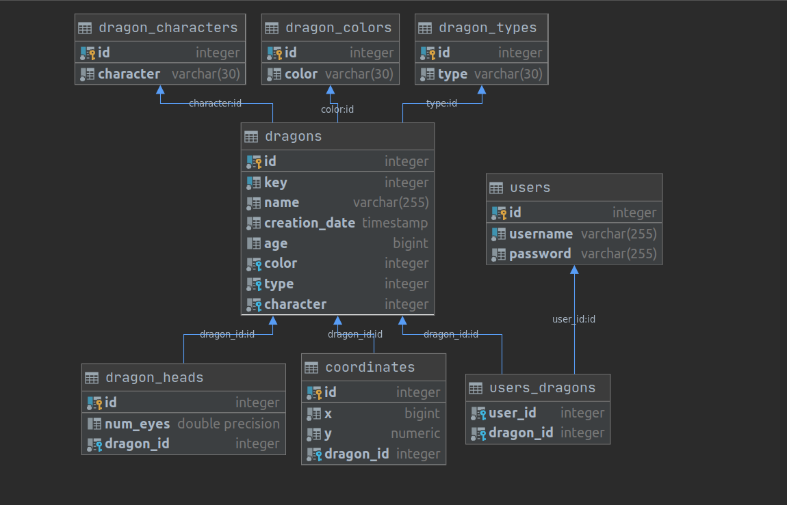

# Progra Lab8 ITMO-2020

**Variant**: 3132395

#### Commands:
* The operating mode is defined by the environment variable mode
* For remote server mode-Dmode=server
* To work in client mode, to connect to the server-Dmode=client

**Client:** 

First represents the mode of operating, second the port to the server we want to connect
```
java -jar -Dmode=client Progra_Lab6.jar 5433
java -jar -Dmode=client Progra_Lab6.jar 5433 localhost
```

First represents the mode of operating, second the port to the server we want to connect and the last is the name of the file from which we take the Dragons for the collection.

**Server:** 
```
java -jar -Dmode=server Progra_Lab6.jar 5433 data.xml
```

**Database Structure:**

The db configuration is taken from the resources file 'db.properties'

And with the file generate_db_script.sql is possible to generate the database ready to run.




#### Текст задания:

Заменить консольный клиент на клиент с графическим интерфейсом пользователя(GUI). 
В функционал клиента должно входить:

1. Окно с авторизацией/регистрацией.
2. Отображение текущего пользователя.
3. Таблица, отображающая все объекты из коллекции
    * Каждое поле объекта - отдельная колонка таблицы.
    * Строки таблицы можно фильтровать/сортировать по значениям любой из колонок. Сортировку и фильтрацию значений столбцов реализовать с помощью Streams API.
4. Поддержка всех команд из предыдущих лабораторных работ.
5. Область, визуализирующую объекты коллекции
    * Объекты должны быть нарисованы с помощью графических примитивов с использованием Graphics, Canvas или аналогичных средств графической библиотеки.
    * При визуализации использовать данные о координатах и размерах объекта.
    * Объекты от разных пользователей должны быть нарисованы разными цветами.
    * При нажатии на объект должна выводиться информация об этом объекте.
    * При добавлении/удалении/изменении объекта, он должен автоматически появиться/исчезнуть/измениться  на области как владельца, так и всех других клиентов. 
    * При отрисовке объекта должна воспроизводиться согласованная с преподавателем анимация.
6. Возможность редактирования отдельных полей любого из объектов (принадлежащего пользователю). Переход к редактированию объекта возможен из таблицы с общим списком объектов и из области с визуализацией объекта.
7. Возможность удаления выбранного объекта (даже если команды remove ранее не было).

Перед непосредственной разработкой приложения необходимо согласовать прототип интерфейса с преподавателем. Прототип интерфейса должен быть создан с помощью средства для построения прототипов интерфейсов(mockplus, draw.io, etc.)


#### Порядок выполнения работы:
* Интерфейс должен быть реализован с помощью библиотеки `JavaFX`
* Графический интерфейс клиентской части должен поддерживать русский, сербский, хорватский и испанский (Эквадор) языки / локали. Должно обеспечиваться корректное отображение чисел, даты и времени в соответстии с локалью. Переключение языков должно происходить без перезапуска приложения. Локализованные ресурсы должны храниться в `классе`.
